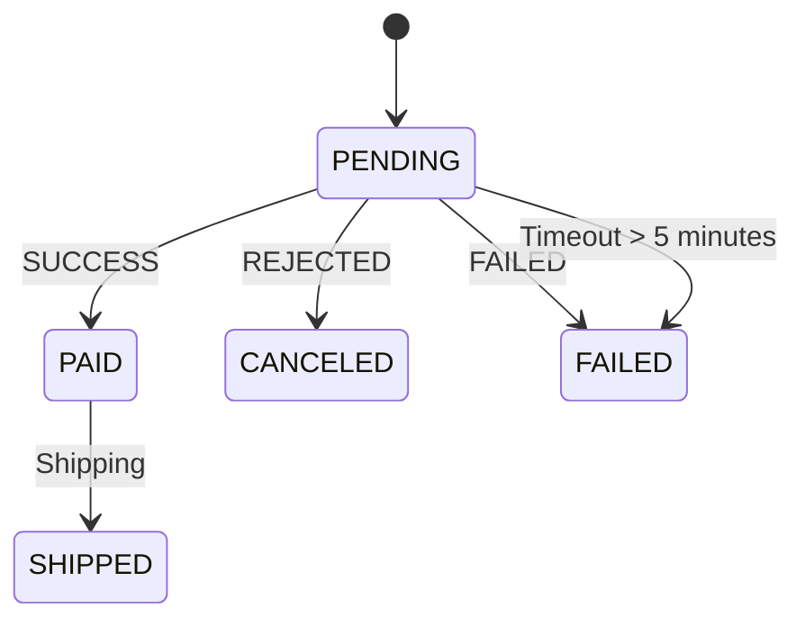

# Order Service - Payment Response & Timeout Handling

## 1. Mục tiêu

Xây dựng một **Order Service** đơn giản sử dụng Spring Boot, có khả năng:

- Tạo Order với trạng thái ban đầu là `PENDING`
- Nhận **Payment Response Event** và cập nhật trạng thái Order theo State Machine
- Xử lý **timeout** nếu Order ở trạng thái `PENDING` quá **5 phút**
- Cung cấp API để kiểm tra và test toàn bộ luồng

---

## 2. Kiến trúc

```
Client
  ↓
Order Controller  (REST API)
  ↓
Order Service     (Business Logic + Event Listener + Scheduled Job)
  ↓
Order Repository  (Spring Data JPA)
  ↓
MySQL (order_db)
```

**Payment Response Flow:**

```
Payment Response (API hoặc Event)
  ↓
PaymentResponseEvent (Spring Application Event)
  ↓
OrderService.handlePaymentResponse()
  ↓
Update Order Status (theo State Machine)
  ↓
Save to MySQL
```

---

## 3. State Machine



| Trạng thái hiện tại | Sự kiện         | Trạng thái mới |
|---------------------|-----------------|----------------|
| PENDING             | SUCCESS         | PAID           |
| PENDING             | REJECTED        | CANCELED       |
| PENDING             | FAILED          | FAILED         |
| PENDING             | Timeout > 5 min | FAILED         |
| PAID                | Shipping        | SHIPPED        |

> **Quy tắc quan trọng:** Chỉ Order đang ở trạng thái `PENDING` mới được xử lý Payment Response. Nếu Order đã là `PAID`, `CANCELED`, `FAILED` hoặc `SHIPPED` thì **bỏ qua** event.

---

## 4. Danh sách API

### 4.1. Tạo Order mới

```
POST /api/orders
```

**Request Body:**
```json
{
  "customerName": "Nguyen Van A"
}
```

**Response (201 Created):**
```json
{
  "id": 1,
  "customerName": "Nguyen Van A",
  "status": "PENDING",
  "createdAt": "2024-01-01T10:00:00",
  "updatedAt": "2024-01-01T10:00:00"
}
```

---

### 4.2. Lấy Order theo ID

```
GET /api/orders/{id}
```

**Response (200 OK):**
```json
{
  "id": 1,
  "customerName": "Nguyen Van A",
  "status": "PAID",
  "createdAt": "2024-01-01T10:00:00",
  "updatedAt": "2024-01-01T10:01:00"
}
```

**Response (404 Not Found):**
```json
{
  "error": "Order not found with id: 1"
}
```

---

### 4.3. Mô phỏng Payment Response (dùng để test)

```
POST /api/orders/{orderId}/payment-response
```

**Request Body:**
```json
{
  "status": "SUCCESS"
}
```

| status value | Kết quả             |
|--------------|---------------------|
| `SUCCESS`    | PENDING → PAID      |
| `REJECTED`   | PENDING → CANCELED  |
| `FAILED`     | PENDING → FAILED    |

---

### 4.4. Mô phỏng Timeout (dùng để test)

```
POST /api/orders/{id}/simulate-timeout
```

Không cần request body. API sẽ đặt `createdAt` về 10 phút trước.  
Scheduled Job (chạy mỗi 60 giây) sẽ phát hiện và chuyển sang `FAILED`.

**Response:**
```json
{
  "message": "createdAt set to 10 minutes ago. Scheduled job will mark this order as FAILED within 60 seconds.",
  "orderId": 1,
  "currentStatus": "PENDING",
  "createdAt": "2024-01-01T09:50:00"
}
```

---

### 4.5. Chuyển sang SHIPPED

```
POST /api/orders/{id}/ship
```

Chỉ hoạt động khi Order đang ở trạng thái `PAID`.

---

## 5. Cách chạy project

### Yêu cầu môi trường

- Java 17+
- Maven 3.6+
- MySQL 8.0+

### Bước 1: Tạo database

```sql
CREATE DATABASE IF NOT EXISTS order_db;
```

### Bước 2: Cấu hình database

Mở file `src/main/resources/application.properties`:

```properties
spring.datasource.url=jdbc:mysql://localhost:3306/order_db?useSSL=false&serverTimezone=UTC&allowPublicKeyRetrieval=true
spring.datasource.username=root
spring.datasource.password=123456   # <-- Sửa password tại đây nếu khác
```

### Bước 3: Build project

```bash
mvn clean install
```

### Bước 4: Chạy project

```bash
mvn spring-boot:run
```

Hoặc chạy file JAR:

```bash
java -jar target/order-service-0.0.1-SNAPSHOT.jar
```

Service chạy tại: **http://localhost:8081**

---

## 6. Cách tạo database

```sql
-- Kết nối vào MySQL
mysql -u root -p

-- Tạo database
CREATE DATABASE IF NOT EXISTS order_db CHARACTER SET utf8mb4 COLLATE utf8mb4_unicode_ci;

-- Kiểm tra
SHOW DATABASES;
```

> **Lưu ý:** Spring Boot với `spring.jpa.hibernate.ddl-auto=update` sẽ tự động tạo bảng `orders` khi khởi động.

---

## 7. Cách test Payment Response

### Test PENDING → PAID

```bash
# Bước 1: Tạo Order
curl -X POST http://localhost:8081/api/orders \
  -H "Content-Type: application/json" \
  -d '{"customerName": "Nguyen Van A"}'
# -> Response: id=1, status=PENDING

# Bước 2: Gửi Payment SUCCESS
curl -X POST http://localhost:8081/api/orders/1/payment-response \
  -H "Content-Type: application/json" \
  -d '{"status": "SUCCESS"}'
# -> Response: status=PAID

# Bước 3: Kiểm tra
curl http://localhost:8081/api/orders/1
# -> status: PAID
```

### Test PENDING → CANCELED

```bash
curl -X POST http://localhost:8081/api/orders \
  -H "Content-Type: application/json" \
  -d '{"customerName": "Tran Thi B"}'

curl -X POST http://localhost:8081/api/orders/2/payment-response \
  -H "Content-Type: application/json" \
  -d '{"status": "REJECTED"}'
# -> status=CANCELED
```

### Test PENDING → FAILED

```bash
curl -X POST http://localhost:8081/api/orders \
  -H "Content-Type: application/json" \
  -d '{"customerName": "Le Van C"}'

curl -X POST http://localhost:8081/api/orders/3/payment-response \
  -H "Content-Type: application/json" \
  -d '{"status": "FAILED"}'
# -> status=FAILED
```

### Test không xử lý lại (PAID + SUCCESS → vẫn PAID)

```bash
# Order 1 đã là PAID từ bước trên
curl -X POST http://localhost:8081/api/orders/1/payment-response \
  -H "Content-Type: application/json" \
  -d '{"status": "SUCCESS"}'
# -> status vẫn là PAID (event bị bỏ qua, log: "Ignoring payment event")
```

---

## 8. Cách test Timeout

```bash
# Bước 1: Tạo Order mới
curl -X POST http://localhost:8081/api/orders \
  -H "Content-Type: application/json" \
  -d '{"customerName": "Pham Van D"}'
# -> id=4, status=PENDING

# Bước 2: Simulate timeout (đặt createdAt về 10 phút trước)
curl -X POST http://localhost:8081/api/orders/4/simulate-timeout
# -> createdAt đã được đặt về quá khứ

# Bước 3: Chờ Scheduled Job chạy (tối đa 60 giây)
# Hoặc kiểm tra log: "Order 4 timeout after 5 minutes -> FAILED"

# Bước 4: Kiểm tra kết quả
curl http://localhost:8081/api/orders/4
# -> status: FAILED
```

---

## 9. Tại sao cần xử lý Timeout?

Trong thực tế, khi người dùng tạo Order và bắt đầu thanh toán, có nhiều tình huống khiến Payment Response **không bao giờ đến**:

- Người dùng đóng trình duyệt giữa chừng
- Kết nối mạng bị gián đoạn
- Payment Gateway gặp sự cố
- Message broker (Kafka, RabbitMQ) bị lỗi và event bị mất

Nếu không xử lý timeout:
- Order mãi ở trạng thái `PENDING` → **tồn kho bị khóa** (nếu có reserve stock)
- Hệ thống không thể phân biệt Order đang xử lý vs Order bị bỏ quên
- Báo cáo/thống kê bị sai

**Giải pháp:** Scheduled Job chạy định kỳ, quét các Order `PENDING` quá thời gian cho phép và chuyển sang `FAILED`, giải phóng tài nguyên.

---

## 10. Vấn đề: Payment đã trừ tiền nhưng Order vẫn PENDING

Đây là vấn đề **consistency** trong hệ thống phân tán, xảy ra khi:

1. Payment Service xử lý thành công và **trừ tiền** khách hàng
2. Nhưng **Payment Response Event bị mất** (lỗi mạng, crash, message queue down)
3. Order Service không nhận được event → Order vẫn `PENDING`
4. Sau 5 phút, Scheduled Job chuyển Order sang `FAILED`

**Hậu quả:** Khách hàng bị trừ tiền nhưng Order bị FAILED → cần **hoàn tiền (refund)**

**Cách xử lý trong thực tế:**

| Giải pháp | Mô tả |
|-----------|-------|
| **Outbox Pattern** | Lưu event vào DB cùng transaction, đảm bảo event không bị mất |
| **Idempotency** | Payment Service kiểm tra trùng lặp trước khi trừ tiền |
| **Saga Pattern** | Mỗi bước có compensating transaction (hoàn tiền nếu Order thất bại) |
| **Dead Letter Queue** | Event thất bại được đưa vào hàng đợi riêng để retry hoặc xử lý thủ công |

> Trong bài tập này, chúng ta sử dụng **Spring Application Event** (in-process) nên không bị mất event. Vấn đề trên chỉ xảy ra khi dùng message broker bên ngoài như Kafka, RabbitMQ.

---

## 11. Cấu trúc project

```
order-service/
├── pom.xml
├── README.md
└── src/
    ├── main/
    │   ├── java/
    │   │   └── com/example/orderservice/
    │   │       ├── OrderServiceApplication.java      # Entry point + @EnableScheduling
    │   │       ├── controller/
    │   │       │   └── OrderController.java           # REST API
    │   │       ├── entity/
    │   │       │   ├── Order.java                     # JPA Entity
    │   │       │   └── OrderStatus.java               # Enum: PENDING, PAID, CANCELED, FAILED, SHIPPED
    │   │       ├── repository/
    │   │       │   └── OrderRepository.java           # Spring Data JPA
    │   │       ├── service/
    │   │       │   └── OrderService.java              # Business Logic + @EventListener + @Scheduled
    │   │       ├── event/
    │   │       │   └── PaymentResponseEvent.java      # Spring Event
    │   │       └── exception/
    │   │           └── OrderNotFoundException.java    # Custom Exception
    │   └── resources/
    │       └── application.properties
    └── test/
        └── java/
            └── com/example/orderservice/
                └── OrderServiceApplicationTests.java  # Unit Tests (5 test cases)
```

---

## 12. Công nghệ sử dụng

| Công nghệ | Version | Mục đích |
|-----------|---------|----------|
| Java | 17 | Ngôn ngữ lập trình |
| Spring Boot | 3.2.5 | Framework chính |
| Spring Web | | REST API |
| Spring Data JPA | | Truy cập database |
| Spring Scheduling | | Xử lý timeout định kỳ |
| MySQL | 8.0+ | Database |
| Lombok | | Giảm boilerplate code |
| JUnit 5 + Mockito | | Unit Testing |
| Maven | 3.6+ | Build tool |
"# 214_SS14_2" 
